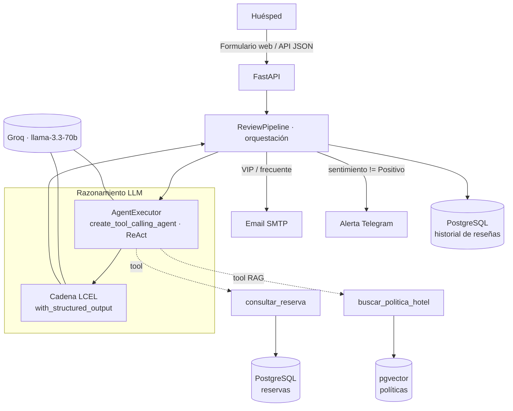

# 🏨 Sistema de Automatización con IA para Gestión de Huéspedes — Hotel Luxury

**Nivel 2 · LangChain** — Proyecto Integrador de *Sistemas Inteligentes 1*, Universidad de Caldas.

Reimplementación en **Python + LangChain** del flujo de automatización construido
originalmente en **n8n** (Nivel 1). El sistema recibe la reseña de un huésped, la analiza
con un **agente de IA** que consulta herramientas (base de datos del hotel y un manual de
políticas vía **RAG**), clasifica el caso, redacta una respuesta personalizada y dispara
acciones automáticas: **correo de compensación** para clientes VIP/frecuentes y **alerta de
Telegram** ante reclamos críticos. Todo queda **persistido** en PostgreSQL.

> 🤖 **Declaración de uso de IA:** la estructura inicial del código y esta documentación se
> elaboraron con asistencia de IA (Claude). El equipo comprende, adaptó y puede explicar
> cada componente, conforme a la política de integridad académica del proyecto.

---

## 📑 Tabla de contenido
1. [Caso de uso](#-caso-de-uso)
2. [Funcionalidades](#-funcionalidades)
3. [Arquitectura](#-arquitectura)
4. [Componentes LangChain](#-componentes-langchain-rúbrica-niv-2)
5. [Comparativa N8n vs. LangChain](#-comparativa-n8n-vs-langchain)
6. [Stack tecnológico](#-stack-tecnológico)
7. [Servicios externos a configurar](#-servicios-externos-a-configurar)
8. [Instalación y ejecución](#-instalación-y-ejecución)
9. [Uso](#-uso)
10. [Estructura del proyecto](#-estructura-del-proyecto)
11. [Tests](#-tests)
12. [Troubleshooting](#-troubleshooting)

---

## 🎯 Caso de uso

**Moderación y respuesta automática de reseñas de huéspedes de un hotel.** Un huésped envía
una reseña; el sistema debe entenderla, clasificarla, responder con empatía usando datos
reales de su reserva y escalar el caso cuando corresponde (compensar VIP, alertar al equipo).

## ✨ Funcionalidades

- 📝 **Captura de reseñas** vía formulario web o API REST (JSON).
- 🧠 **Análisis con agente de IA** (sentimiento + categoría + respuesta) usando `ChatGroq`.
- 🔧 **Herramientas (Tools)** que el agente decide usar autónomamente:
  - `consultar_reserva`: busca al huésped en la base de datos del hotel (PostgreSQL).
  - `buscar_politica_hotel`: **RAG** sobre el manual de políticas internas (pgvector).
- 🏷️ **Salida estructurada** garantizada con Pydantic (`with_structured_output`).
- 📧 **Correo de compensación** (SMTP) automático para huéspedes **VIP/frecuentes**.
- 🚨 **Alerta de Telegram** ante reseñas **no positivas** (reclamo crítico).
- 🗄️ **Persistencia** de cada caso en PostgreSQL (reemplaza Google Sheets).
- 🧾 **Bitácora de razonamiento** en JSONL (cadena de pensamiento auditable).
- 🐳 **Docker** para dos escenarios: **desarrollo** (hot-reload + Adminer) y **producción**.

## 🏗️ Arquitectura



**Patrón de diseño:** arquitectura por capas con separación de responsabilidades.

```
API (FastAPI)  →  Pipeline (orquestación)  →  Agente/Cadenas (LangChain)
                                            →  Servicios (email, Telegram)
                                            →  Repositorios (DB)  →  PostgreSQL/pgvector
```

> **Decisión clave:** el **razonamiento** (agente + RAG) está separado de los **efectos
> secundarios** (email, Telegram, persistencia), que se ejecutan de forma **determinista** en
> el pipeline. Esto los hace predecibles, testeables y auditables.

## 🧩 Componentes LangChain (rúbrica Niv. 2)

| Componente | Implementación | Archivo |
|---|---|---|
| **LLM** | `ChatGroq` · `llama-3.3-70b-versatile` · `temperature=0.3` (agente) y `0.0` (extracción) | [llm.py](app/core/llm.py) |
| **ChatPromptTemplate** | `system` + `human` + `MessagesPlaceholder("agent_scratchpad")` | [prompts.py](app/agent/prompts.py) |
| **Tools** | `consultar_reserva` (BD) y `buscar_politica_hotel` (RAG) | [tools.py](app/agent/tools.py) |
| **Agent** | `create_tool_calling_agent` + `AgentExecutor` (estilo **ReAct**) | [analyzer.py](app/agent/analyzer.py) |
| **Chain (LCEL)** | `EXTRACTION_PROMPT \| llm.with_structured_output(ReviewAnalysis)` | [analyzer.py](app/agent/analyzer.py) |
| **Cadena de pensamiento** | ReAct (el agente razona → invoca tool → observa → decide), registrada en JSONL | [reasoning_logger.py](app/agent/reasoning_logger.py) |
| **RAG / Vector store** | `PGVector` (pgvector) + embeddings multilingües · `RecursiveCharacterTextSplitter` | [vector_store.py](app/rag/vector_store.py), [retriever.py](app/rag/retriever.py) |
| **Salida estructurada** | Pydantic `ReviewAnalysis` (Literales para sentimiento y categoría) | [review.py](app/schemas/review.py) |

**Cadena de pensamiento (ejemplo del log `logs/reasoning.jsonl`):**
```json
{"event": "agent_step", "herramienta": "consultar_reserva", "entrada": {"nombre": "Marta Gómez"}, "observacion": "Reserva activa... Habitación: 204... Tipo: vip."}
{"event": "agent_step", "herramienta": "buscar_politica_hotel", "entrada": {"consulta": "aire acondicionado no funciona"}, "observacion": "Políticas... climatización prioritaria... descuento 20%."}
{"event": "extraction", "sentimiento": "Negativo", "categoria": "Habitaciones y Limpieza"}
```

## 🔄 Comparativa N8n vs. LangChain

| Aspecto | N8n (Nivel 1) | LangChain (Nivel 2) |
|---|---|---|
| Paradigma | Visual, nodos enlazados | Código Python modular |
| LLM | Nodo *Groq Chat Model* | `ChatGroq` (mismo modelo) |
| Agente + herramientas | *AI Agent* + *Code Tool* | `AgentExecutor` + `@tool` |
| Salida estructurada | *Information Extractor* | `with_structured_output` (Pydantic) |
| Base de datos del huésped | JS simulado en *Code Tool* | Tabla real en **PostgreSQL** |
| Persistencia del historial | **Google Sheets** | Tabla `reviews` en **PostgreSQL** |
| Correo | Nodo **Gmail** (dirección fija) | **SMTP** al email real del huésped |
| Alerta | Nodo **Telegram** | Servicio Telegram (httpx) |
| **RAG (manual de políticas)** | ❌ **Descartado** por complejidad de la UI* | ✅ **Implementado** con pgvector |
| Versionado / tests | Limitado | Git + `pytest` + tipado |
| Control de flujo | Cableado visual | Lógica explícita y testeable |

\* En el flujo n8n el equipo intentó añadir un *Simple Vector Store* (Nivel 3) pero lo
descartó por conflictos de la interfaz (ver [troubleshooting](#-troubleshooting)). En
LangChain el **RAG es directo**, convirtiendo una limitación de n8n en una ventaja del código.

## 🛠️ Stack tecnológico

- **Lenguaje:** Python 3.12
- **IA:** LangChain ≥ 0.3, LangChain-Groq
- **LLM:** Groq — `llama-3.3-70b-versatile`
- **Embeddings:** HuggingFace `paraphrase-multilingual-MiniLM-L12-v2` (offline, multilingüe)
- **Vector store + BD:** PostgreSQL 16 + **pgvector**
- **API web:** FastAPI + Uvicorn (+ Jinja2 para el formulario)
- **ORM:** SQLAlchemy 2.0 (psycopg3)
- **Notificaciones:** Telegram Bot API (httpx), correo SMTP
- **Contenedores:** Docker + Docker Compose

## 🔌 Servicios externos a configurar

| Servicio | ¿Obligatorio? | Para qué | Cómo obtenerlo |
|---|---|---|---|
| **Groq API** | ✅ Sí | LLM del agente y la extracción | Gratis en [console.groq.com/keys](https://console.groq.com/keys) → `GROQ_API_KEY` |
| **PostgreSQL + pgvector** | ✅ Sí | Reservas, historial y vectores RAG | Incluido en Docker (`pgvector/pgvector`). En la nube: Supabase / Neon / RDS |
| **Bot de Telegram** | ⬜ Opcional | Alerta de reclamos críticos | `@BotFather` → `TELEGRAM_BOT_TOKEN`; chat id con `@userinfobot` → `TELEGRAM_CHAT_ID` |
| **Servidor SMTP** | ⬜ Opcional | Correo de compensación VIP | Gmail (contraseña de aplicación) o **Mailtrap** (dev) → `SMTP_*` |
| **Embeddings** | — | RAG | Por defecto **local** (HuggingFace, sin API key). Alternativas: `fastembed`, OpenAI |

> Telegram y SMTP **degradan con elegancia**: si no se configuran, esas funciones se
> desactivan con un aviso en el log y el resto del sistema sigue operando. Lo mínimo para
> arrancar es **Groq + PostgreSQL**.

## 🚀 Instalación y ejecución

### Requisitos
- Docker + Docker Compose (recomendado), **o** Python 3.12 + PostgreSQL con pgvector.

### 1) Configurar variables de entorno
```bash
cp .env.example .env
# Edita .env y coloca al menos GROQ_API_KEY.
```

### 2A) Con Docker — Desarrollo (recomendado)
Hot-reload, código montado y Adminer para inspeccionar la BD.
```bash
docker compose up --build
```
- App / formulario: <http://localhost:8000>
- Documentación API (Swagger): <http://localhost:8000/docs>
- Adminer (BD): <http://localhost:8080>  (sistema: PostgreSQL, servidor: `db`, usuario/clave: `hotel`)

> En el primer arranque se descarga el modelo de embeddings (unos minutos) y se siembran
> automáticamente las reservas y las políticas (`AUTO_INIT=true`).

### 2B) Con Docker — Producción
Imagen inmutable, varios workers, reinicio automático y un servicio `init` que prepara la BD.
```bash
docker compose -f docker-compose.yml -f docker-compose.prod.yml up -d --build
```

### 2C) Sin Docker (local)
```bash
python -m venv .venv && source .venv/bin/activate    # Windows: .venv\Scripts\Activate.ps1
pip install -r requirements.txt
# Asegúrate de tener PostgreSQL con la extensión vector y ajusta DATABASE_URL en .env
python -m scripts.seed_db            # siembra reservas
python -m scripts.ingest_policies    # indexa políticas (RAG)
uvicorn app.main:app --reload
```

## 💻 Uso

### Formulario web
Abre <http://localhost:8000>, escribe un nombre y una reseña, y envía. Prueba con
**"Marta Gómez"** (VIP), **"Sebastián"** (frecuente) o **"Carlos Mendoza"** (regular).

### API REST
```bash
curl -X POST http://localhost:8000/api/reviews \
  -H "Content-Type: application/json" \
  -d '{
        "nombre_huesped": "Marta Gómez",
        "resena": "El aire acondicionado de mi habitación no funciona y hace un calor insoportable."
      }'
```

Respuesta (resumida):
```json
{
  "nombre_huesped": "Marta Gómez",
  "analisis": {
    "sentimiento": "Negativo",
    "categoria": "Habitaciones y Limpieza",
    "respuesta_automatica": "Estimada Marta, lamentamos el inconveniente con el aire acondicionado de su habitación 204…"
  },
  "reserva": { "habitacion": "204", "noches": 3, "tipo_cliente": "vip" },
  "email_compensacion_enviado": true,
  "alerta_telegram_enviada": true,
  "id_registro": 1
}
```

Otros endpoints: `GET /api/reviews` (historial), `GET /health`, `POST /admin/ingest` (reindexar RAG).

## 📂 Estructura del proyecto
```
.
├── app/
│   ├── core/        # config, logging, fábricas de LLM y embeddings
│   ├── schemas/     # modelos Pydantic (contratos / structured output)
│   ├── db/          # SQLAlchemy: modelos, sesión, seed, repositorios
│   ├── rag/         # vector store (pgvector) e ingesta/retrieval
│   ├── agent/       # prompts, tools, analyzer (agente + cadena), reasoning log
│   ├── services/    # notificaciones (Telegram) y correo (SMTP)
│   ├── pipeline/    # orquestación del flujo (réplica del workflow n8n)
│   ├── api/         # rutas FastAPI
│   ├── templates/   # formulario y resultado (HTML)
│   └── main.py      # punto de entrada FastAPI
├── data/policies/   # manual de políticas del hotel (fuente del RAG)
├── scripts/         # seed_db.py, ingest_policies.py
├── tests/           # tests unitarios offline
├── workflow/        # JSON de los flujos n8n del Nivel 1 (referencia)
├── docker/          # init.sql (extensión pgvector)
├── Dockerfile · docker-compose*.yml · Makefile
└── requirements.txt · .env.example
```

## 🧪 Tests
```bash
pip install -r requirements-dev.txt
pytest            # tests offline: normalización, matching de reservas y validación de esquema
ruff check app    # linter
```

## 🩺 Troubleshooting

**Heredado del flujo n8n (Nivel 1), documentado para la comparación:**

- **`$helpers is not defined` en el Code Tool de n8n.** Las versiones modernas de n8n
  bloquean el envío de correo desde código personalizado. *Solución en n8n:* delegar el
  envío al nodo nativo Gmail. *En LangChain:* el envío es un servicio SMTP aislado
  ([email.py](app/services/email.py)), sin esa restricción.
- **RAG inviable en la UI de n8n.** El *Simple Vector Store* generaba conflictos de puertos
  entre el cargador de datos y la herramienta del agente. *En LangChain:* el RAG se resuelve
  con `PGVector` + un retriever en pocas líneas.

**De este proyecto (LangChain):**

- **`extension "vector" is not available`** → usa la imagen `pgvector/pgvector:pg16` (ya
  configurada) o ejecuta `CREATE EXTENSION vector;` (lo hace [docker/init.sql](docker/init.sql)).
- **Primer arranque lento** → se descarga el modelo de embeddings; queda cacheado en el
  volumen `hf_cache`.
- **`GROQ_API_KEY no está configurada`** → define la clave en `.env`.
- **No llegan correos/alertas** → es esperado si no configuraste SMTP/Telegram; revisa el log.

---

*Universidad de Caldas · Facultad de Ingenierías · Sistemas Inteligentes 1 · 2026*
